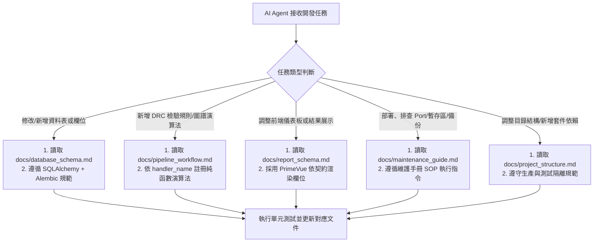

# 線路設計規則檢查系統 (Schematic DRC System) - DesignShield

[](https://opensource.org/licenses/MIT)
[](https://www.python.org/)
[](https://fastapi.tiangolo.com/)
[](https://vuejs.org/)
[](https://primevue.org/)
[](https://www.postgresql.org/)
[](https://redis.io/)

本專案是一套專為硬體工程師設計的自動化**「線路設計規則檢查系統」(Schematic Design Rule Check System)**。系統整合 Cadence OrCAD Capture XML 與 Netlist 檔案解析，利用 **NetworkX** 構建電路二分異質圖譜 (Bipartite Heterogeneous Graph)，並結合**傳統啟發式圖論演算法 (Heuristic DRC)** 與**大語言模型 (LLM Assisted Analysis)**，自動檢測電路圖中潛在的硬體設計缺陷與違規。

---

## 📚 AI Agent 與開發者文件導覽入口 (Documentation Index)

為使 AI Agent (如 Cursor、Gemini CLI、Claude Code 等) 與開發者能迅速掌握系統全局，本專案將核心知識解構為獨立模組化文件放置於 [`docs/`](file:///home/gaven/DesignShield/docs/) 目錄。

### 1. 文件清單與用途索引

| 序號 | 文件檔案名稱 | 文件用途與內容概要 | 適合閱讀之情境 / 任務類型 |
| :---: | :--- | :--- | :--- |
| **0** | [`AGENT.md`](file:///home/gaven/DesignShield/AGENT.md) | **全專案開發最高原則**：繁體中文輸出規範、JSDoc/註解標準、檔案拆分守則、單元測試要求、API/文件同步維護、密碼環境變數原則。 | **每次開始任務前必讀** |
| **1** | [`docs/project_structure.md`](file:///home/gaven/DesignShield/docs/project_structure.md) | **專案結構與文件策略**：Monorepo 資料夾劃分、代碼與測試四重實體隔離防護、Poetry 依賴群組、第三方套件 (Adapter Pattern) 封裝規範。 | 規劃新增目錄、模組重構、配置測試環境時 |
| **2** | [`docs/product_spec.md`](file:///home/gaven/DesignShield/docs/product_spec.md) | **產品規格書**：系統核心需求、無狀態 API 原則、單任務 FIFO 排隊保護機制、LiteLLM 統一適配層、全鏈路 Langfuse 觀測與 Phase 2 規劃。 | 瞭解產品全貌、排程架構、業務邊界與擴充規劃時 |
| **3** | [`docs/database_schema.md`](file:///home/gaven/DesignShield/docs/database_schema.md) | **資料庫綱要與 ERD**：PostgreSQL 資料表結構 (`drc_rules`, `drc_tasks`, `drc_reports`, `system_settings`)、JSONB 參數規格、觸發標籤與索引設計。 | 開發 SQLAlchemy Model、Alembic 遷移或 DB CRUD 時 |
| **4** | [`docs/pipeline_workflow.md`](file:///home/gaven/DesignShield/docs/pipeline_workflow.md) | **分析管線與圖譜規範**：NetworkX 二分異質圖資料契約 (Node/Edge/電氣數值剖析)、上傳預先分析 (Pre-analysis)、Heuristic 規則註冊與 LLM 局部子圖萃取。 | 撰寫電路解析器、圖論檢查演算法、LLM Prompt 萃取時 |
| **5** | [`docs/report_schema.md`](file:///home/gaven/DesignShield/docs/report_schema.md) | **DRC 報告資料規格標準**：後端輸出與前端 PrimeVue 契約，包含 Summary Dashboard、各違規項目 (Violation / Check Item) JSON 結構與佐證歷程規格。 | 撰寫報告彙整邏輯 (Report Synthesis)、前端儀表板繪製時 |
| **6** | [`docs/maintenance_guide.md`](file:///home/gaven/DesignShield/docs/maintenance_guide.md) | **技術維護與運維手冊**：微服務架構職責、Docker 容器運行 Port 矩陣、暫存區與儲存路徑、資料庫儲存位置、自動備份腳本與伺服器轉移復原 SOP。 | 系統部署、Docker 維護、磁碟空間清理、備份與移轉災備時 |

### 2. AI Agent 任務情境速查路徑 (Agent Reading Route)



---

## 🛠️ 系統架構簡介 (Architecture Overview)

系統採前後端分離的單一儲存庫 (Monorepo) 架構：
* **前端 (Frontend)**: Vue 3 + TypeScript + PrimeVue v4 (Dashboard 介面) + Pinia。
* **後端 API (Backend API)**: FastAPI (無狀態 RESTful API + WebSocket/SSE 進度推播)。
* **任務執行器 (Task Worker)**: Celery (Python)，**Concurrency = 1，採嚴格 FIFO 排隊**，搭配細顆粒度動作逾時 (Action Timeout: 60s) 與 LLM 呼叫逾時 (45s)。
* **訊息仲介 (Message Broker)**: Redis 7 (任務派發、分散式鎖與快取)。
* **關聯式資料庫 (Database)**: PostgreSQL 16 (持久化儲存規則、任務與報告)。
* **模型與觀測性**: LiteLLM (多模型統一代理) + Langfuse (全鏈路 Trace 追蹤)。

---

## 💻 環境安裝與事前準備 (Prerequisites & Installation)

### 1. 系統環境需求
* **作業系統**: Linux (推薦 Ubuntu 22.04 LTS+ / Debian 12+)、macOS、或 Windows (搭配 WSL2)。
* **容器平台**: Docker 24.0+ 與 Docker Compose v2.20+。
* **本地開發軟體需求 (僅本地非 Docker 開發需要)**:
  * Python 3.11+
  * [Poetry](https://python-poetry.org/) 1.8+ (後端依賴管理)
  * Node.js 20+ 與 [pnpm](https://pnpm.io/) 9+ (前端套件管理)

### 2. 複製專案與環境變數設定

```bash
# 1. 複製儲存庫
git clone <repository_url> DesignShield
cd DesignShield

# 2. 複製環境變數範本並填入設定
cp .env.example .env
```

#### 重要環境變數說明 (`.env`):
```ini
# 資料庫配置
POSTGRES_USER=postgres
POSTGRES_PASSWORD=your_secure_password_here
POSTGRES_DB=drc_db
POSTGRES_HOST=postgres
POSTGRES_PORT=5432

# Redis 配置
REDIS_HOST=redis
REDIS_PORT=6379

# LLM 與 LiteLLM 配置 (金鑰勿上傳至 Git)
OPENAI_API_KEY=your_openai_key_here
GEMINI_API_KEY=your_gemini_key_here
DEFAULT_LLM_MODEL=litellm/gemini-2.5-pro

# 系統運算逾時保護 (秒)
DEFAULT_ACTION_TIMEOUT=60
DEFAULT_LLM_TIMEOUT=45

# Langfuse 全鏈路追蹤 (選用)
LANGFUSE_PUBLIC_KEY=your_public_key
LANGFUSE_SECRET_KEY=your_secret_key
LANGFUSE_HOST=https://cloud.langfuse.com
```

---

## 🚀 系統啟動指南 (Quick Start Guide)

本專案支援 **「一鍵 Docker Compose 啟動」**（推薦用於生產與整合測試）與 **「本地開發模式啟動」**。

### 方案 A：一鍵 Docker Compose 啟動 (推薦)

透過容器快速啟動所有服務 (PostgreSQL, Redis, Backend API, Celery Worker, Celery Beat, Frontend)：

```bash
# 1. 進入部署目錄
cd deploy

# 2. 建立必要儲存目錄
mkdir -p ../storage/uploads ../storage/staging ../storage/graphs ../storage/reports ../logs

# 3. 構建並啟動所有微服務
docker compose up -d --build

# 4. 檢查容器運行狀態
docker compose ps
```

啟動完成後，各服務存取入口如下：
* **前端 Web 介面**: `http://localhost:5173` (開發模式) 或 `http://localhost` (生產 Nginx)
* **後端 API 互動式文件 (Swagger UI)**: `http://localhost:8000/docs`
* **API 健康檢查端點**: `http://localhost:8000/health`
* **Langfuse 追蹤後台 (若啟用)**: `http://localhost:3000`

---

### 方案 B：本地開發模式手動啟動 (Local Development)

若需要針對前端 UI 或後端 Engine 進行深度除錯與熱重載開發：

#### 步驟 1：啟動基礎設施 (Postgres & Redis)
```bash
cd deploy
docker compose up -d postgres redis
```

#### 步驟 2：後端虛擬環境安裝與啟動
```bash
cd ../backend

# 安裝所有依賴 (包含開發與測試工具)
poetry install

# 執行資料庫遷移
poetry run alembic upgrade head

# 啟動 FastAPI 開發伺服器 (具備自動重載)
poetry run uvicorn app.main:app --host 0.0.0.0 --port 8000 --reload
```

#### 步驟 3：啟動 Celery Worker (於新終端機視窗)
```bash
cd backend
# 嚴格限制單並發 (Concurrency = 1)
poetry run celery -A app.worker.celery_app worker --loglevel=info --concurrency=1
```

#### 步驟 4：啟動前端開發伺服器 (於新終端機視窗)
```bash
cd ../frontend

# 安裝依賴
pnpm install

# 啟動 Vite 開發伺服器
pnpm dev
```

---

## 🧪 測試執行與品質保證 (Testing & Quality Assurance)

根據專案最高原則 (`AGENT.md`)：**每次提交代碼前必須執行測試**。本專案將測試代碼與生產環境進行了 100% 實體隔離。

### 1. 後端測試 (Pytest)
```bash
cd backend

# 執行所有測試並計算覆蓋率
poetry run pytest --cov=app tests/

# 僅執行單元測試 (不需啟動任何外部服務，毫秒級完成)
poetry run pytest tests/unit/

# 執行整合測試 (需啟動本地測試用 DB)
poetry run pytest tests/integration/
```

### 2. 前端測試 (Vitest & Playwright)
```bash
cd frontend

# 執行前端單元測試 (元件與 Pinia Store)
pnpm test:unit

# 執行端到端 (E2E) 測試
pnpm test:e2e
```

---

## 🔧 系統維護、備份與移轉 (Maintenance & Operations)

完整維護細節請詳細參閱 [`docs/maintenance_guide.md`](file:///home/gaven/DesignShield/docs/maintenance_guide.md)。以下列出常用維維指令：

```bash
# 檢視 Celery Worker 即時日誌
docker compose logs -f celery-worker

# 檢視目前 Redis 佇列等待任務數
docker compose exec redis redis-cli llen celery

# 備份資料庫至本地檔案
docker exec -t drc-postgres pg_dump -U postgres -d drc_db -Fc > /tmp/drc_db_backup.dump

# 清理過期暫存中繼檔案 (可由 Celery Beat 自動清理)
find ./storage/staging/ -mindepth 1 -mtime +1 -exec rm -rf {} +
```

---

## 📜 開發規範與原則 (Engineering Principles)

本專案所有貢獻者與 AI Agent 請務必遵守 [`AGENT.md`](file:///home/gaven/DesignShield/AGENT.md) 核心規範：
1. **永遠使用繁體中文**：所有回應、文件、註解及 Task 規劃一律採用繁體中文。
2. **易讀註解與 JSDoc 標準**：每個函數均需提供人讀註解與標準化型別說明。
3. **模組適度拆分**：單一檔案嚴格避免過大 (超過 1000 行評估拆分)，保持好維護與 LLM 友善。
4. **敏感資訊隔離**：密碼、Token 與 API Key 一律透過環境變數傳遞，嚴禁寫死在代碼中。
5. **文檔與代碼同步**：任何 API 或架構異動，必須同步維護 `docs/` 文件與 `README.md`。
