# 資料庫結構規劃 (Database Schema Specification)

本文檔定義線路設計規則檢查系統 (Schematic DRC System) 於 PostgreSQL 資料庫中的資料表綱要 (Schema) 設計。本設計使用 SQLAlchemy ORM 進行映射，並配合 Alembic 進行資料庫遷移管理。

---

## 1. 資料庫實體關聯概覽 (ERD)

```mermaid
erDiagram
    drc_tasks ||--o| drc_reports : "產生"
    drc_rules ||--o{ rule_presets : "包含於"
    system_settings {
        string key PK
        jsonb value
        string description
    }
    drc_rules {
        string id PK
        string name
        string category
        string check_type
        string handler_name
        jsonb parameters
        string prompt_template
        string context_extractor
        jsonb triggers
        string severity
        text description_zh
        text suggestion_zh
        boolean is_active
    }
    drc_tasks {
        uuid id PK
        string project_name
        string status
        jsonb pre_analysis_summary
        jsonb selected_rules
        jsonb execution_config
        string current_step
        int progress_percentage
        jsonb file_paths
    }
    drc_reports {
        uuid task_id PK,FK
        jsonb summary
        jsonb violations
        float total_execution_time_seconds
    }
```



---

## 2. 資料表詳細定義

### 2.1 規則庫資料表 (`drc_rules`)
儲存所有傳統程式演算法規則 (HEURISTIC) 與大語言模型邏輯規則 (LLM)。所有規則均具備完整的人類易讀中文說明，供工程師於 Web UI 查閱與維護。

```sql
CREATE TABLE drc_rules (
    id VARCHAR(64) PRIMARY KEY,                  -- 規則唯一編號，如 "RULE-BUS-I2C-ADDR"
    name VARCHAR(255) NOT NULL,                  -- 中文規則名稱，如 "I2C 匯流排地址唯一性檢查"
    category VARCHAR(64) NOT NULL,               -- 規則分類，如 "Bus Integrity", "Power Domain", "Pin Connection"
    check_type VARCHAR(16) NOT NULL,             -- 檢測機制："HEURISTIC" (純程式演算法) 或 "LLM" (語意推理)
    handler_name VARCHAR(128),                   -- 若為 HEURISTIC，對應後端 Engine 註冊的函式識別碼
    parameters JSONB NOT NULL DEFAULT '{}',      -- 規則門檻與匹配參數 (如電阻範圍、正則表示式)
    prompt_template TEXT,                        -- 若為 LLM，存放 System/User Prompt 模板 (含變數佔位符)
    context_extractor VARCHAR(128),              -- 若為 LLM，指定從 NetworkX 提取局部子圖的萃取器名稱
    triggers JSONB NOT NULL DEFAULT '[]',        -- 預先分析時觸發自動推薦的標籤條件
    severity VARCHAR(16) NOT NULL DEFAULT 'HIGH',-- 嚴重性："CRITICAL", "HIGH", "MEDIUM", "LOW", "INFO"
    description_zh TEXT NOT NULL,                -- 完整的中文規則說明 (設計原理、工程背景)
    suggestion_zh TEXT NOT NULL,                 -- 完整的中文違規修正建議 (修復方針)
    is_active BOOLEAN NOT NULL DEFAULT TRUE,     -- 是否啟用此規則
    created_at TIMESTAMP WITH TIME ZONE DEFAULT NOW(),
    updated_at TIMESTAMP WITH TIME ZONE DEFAULT NOW()
);

-- 建立索引加速依類別與啟用狀態查詢
CREATE INDEX idx_drc_rules_category ON drc_rules(category);
CREATE INDEX idx_drc_rules_is_active ON drc_rules(is_active);
```

#### `parameters` (JSONB) 欄位範例：
* **I2C 匯流排上拉電阻檢查**：
  ```json
  {
    "bus_type": "I2C",
    "pull_up_required": true,
    "min_resistance_ohm": 1000,
    "max_resistance_ohm": 10000,
    "allowed_power_rails": ["VDD", "VCC_3V3", "VCC_1V8"]
  }
  ```
* **電容耐壓降額檢查 (Capacitor Derating)**：
  ```json
  {
    "derating_factor": 0.7, // 工作電壓不得超過額定耐壓的 70%
    "target_roles": ["Passive/Capacitor"]
  }
  ```

#### `triggers` (JSONB) 欄位範例（供預先分析自動推薦）：
* 全域規則（無條件推薦）：
  ```json
  [{ "type": "GLOBAL" }]
  ```
* 匯流排觸發（偵測到 I2C 總線時推薦）：
  ```json
  [{ "type": "BUS", "target": "I2C" }]
  ```
* 核心平台觸發（偵測到 ESP32 或 STM32 主控時推薦）：
  ```json
  [{ "type": "PLATFORM", "target": "ESP32" }, { "type": "PLATFORM", "target": "STM32" }]
  ```

---

### 2.2 任務排程資料表 (`drc_tasks`)
記錄所有電路圖上傳、預先分析狀態、Celery 排隊進度與執行設定。

```sql
CREATE TABLE drc_tasks (
    id UUID PRIMARY KEY DEFAULT gen_random_uuid(),
    project_name VARCHAR(255) NOT NULL,          -- 專案名稱
    status VARCHAR(32) NOT NULL DEFAULT 'PENDING',
    -- 狀態列舉: PENDING (排隊中), PRE_ANALYZING, READY_FOR_RUN, PROCESSING (正式分析中), COMPLETED, FAILED, REVOKED (已取消)
    
    pre_analysis_summary JSONB DEFAULT '{}',     -- 預先分析結果 (偵測到的核心 IC, 匯流排, 平台)
    selected_rules JSONB DEFAULT '[]',           -- 使用者在 UI 勾選要執行的 rule_id 清單
    
    execution_config JSONB NOT NULL DEFAULT '{
        "action_timeout_seconds": 60,
        "llm_timeout_seconds": 45,
        "llm_model": "litellm/gemini-2.5-pro"
    }',                                          -- 本任務執行的細部逾時與模型配置
    
    current_step VARCHAR(64),                    -- 當前執行步驟 (如 "Heuristic DRC: I2C Address")
    progress_percentage INT DEFAULT 0,           -- 執行百分比 (0-100)
    
    file_paths JSONB NOT NULL DEFAULT '{}',      -- 關聯檔案路徑 {"zip": "...", "xml": "...", "pdf": "..."}
    error_message TEXT,                          -- 若失敗時的錯誤摘要
    
    created_at TIMESTAMP WITH TIME ZONE DEFAULT NOW(),
    started_at TIMESTAMP WITH TIME ZONE,
    completed_at TIMESTAMP WITH TIME ZONE
);

CREATE INDEX idx_drc_tasks_status ON drc_tasks(status);
CREATE INDEX idx_drc_tasks_created_at ON drc_tasks(created_at);
```

---

### 2.3 報告結果資料表 (`drc_reports`)
儲存正式分析完成後的完整分析報告，供 Web 儀表板快速載入與匯出。

```sql
CREATE TABLE drc_reports (
    task_id UUID PRIMARY KEY REFERENCES drc_tasks(id) ON DELETE CASCADE,
    summary JSONB NOT NULL,                      -- 對應 report_schema.md 的 Summary Dashboard
    violations JSONB NOT NULL,                   -- 對應 report_schema.md 的完整檢查結果陣列
    total_execution_time_seconds FLOAT NOT NULL, -- 總耗時
    created_at TIMESTAMP WITH TIME ZONE DEFAULT NOW()
);
```

---

### 2.4 系統設定資料表 (`system_settings`)
儲存全域系統等級的預設配置（支援 Web UI 系統管理員修改，無須重啟服務）。

```sql
CREATE TABLE system_settings (
    key VARCHAR(64) PRIMARY KEY,                 -- 設定鍵，如 "DEFAULT_ACTION_TIMEOUT"
    value JSONB NOT NULL,                        -- 設定值
    description VARCHAR(255),                    -- 描述
    updated_at TIMESTAMP WITH TIME ZONE DEFAULT NOW()
);

-- 初始化預設值範例
INSERT INTO system_settings (key, value, description) VALUES
('TIMEOUT_CONFIG', '{"default_action_timeout_sec": 60, "default_llm_timeout_sec": 45, "max_retry": 2}', '細部運算與 LLM 請求預設逾時時間'),
('FILE_TTL_DAYS', '7', '上傳檔案與中繼報告保留天數');
```
