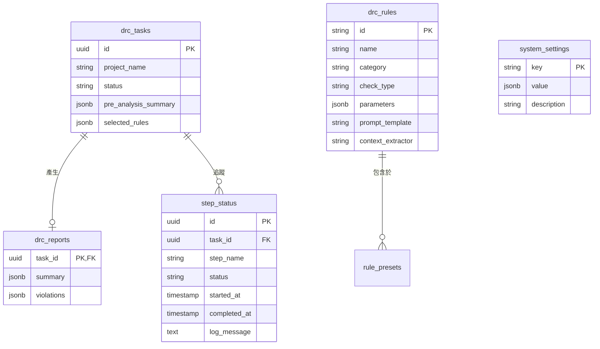

# 資料庫結構規劃 (Database Schema Specification)

本文檔定義線路設計規則檢查系統 (Schematic DRC System) 於 PostgreSQL 資料庫中的資料表綱要 (Schema) 設計。本設計使用 SQLAlchemy ORM 與 DBOS，並配合 Alembic 進行資料庫遷移管理。

---

## 1. 資料庫實體關聯概覽 (ERD)



---

## 2. 資料表詳細定義

### 2.1 規則庫資料表 (`drc_rules`)
儲存傳統程式演算法規則與 LLM 邏輯規則。

### 2.2 任務狀態與進度 (`drc_tasks` 與 `step_status`)
`drc_tasks` 記錄總體任務資訊，`step_status` 用於紀錄 DBOS 執行步驟的狀態。由於系統採用 DBOS，`step_status` 表可讓前端 Vue 3 以 PrimeVue Timeline 視覺化渲染進度。

```sql
CREATE TABLE drc_tasks (
    id UUID PRIMARY KEY DEFAULT gen_random_uuid(),
    project_name VARCHAR(255) NOT NULL,
    status VARCHAR(32) NOT NULL DEFAULT 'PENDING',
    pre_analysis_summary JSONB DEFAULT '{}',
    selected_rules JSONB DEFAULT '[]',
    created_at TIMESTAMP WITH TIME ZONE DEFAULT NOW()
);

CREATE TABLE step_status (
    id UUID PRIMARY KEY DEFAULT gen_random_uuid(),
    task_id UUID REFERENCES drc_tasks(id) ON DELETE CASCADE,
    step_name VARCHAR(128) NOT NULL,
    status VARCHAR(32) NOT NULL DEFAULT 'PENDING',
    log_message TEXT,
    started_at TIMESTAMP WITH TIME ZONE DEFAULT NOW(),
    completed_at TIMESTAMP WITH TIME ZONE
);
```

### 2.3 報告結果資料表 (`drc_reports`)
儲存完整分析報告，供 Web 儀表板快速載入。

### 2.4 系統設定資料表 (`system_settings`)
儲存保留天數與逾時配置，供系統設定 UI 動態調整。
