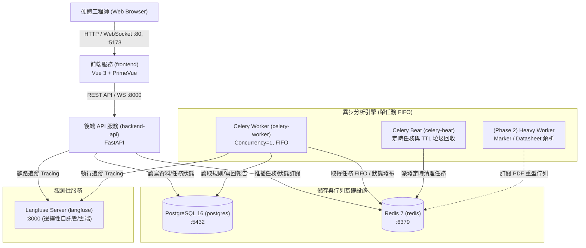

# 技術維護手冊 (Technical Maintenance & Operations Manual)

本文檔為**線路設計規則檢查系統 (Schematic DRC System)** 的技術運維與維護手冊。提供系統架構中各微服務、Docker 容器連接埠 (Port)、檔案暫存與持久化路徑、資料庫儲存規劃、備份策略及伺服器轉移 (Migration) 與災難復原標準作業程序 (SOP)。

---

## 1. 系統架構與微服務角色職責 (Microservices Architecture)

本系統採單一儲存庫 (Monorepo) 架構，所有核心組件均容器化部署。系統包含前端展示層、API 網關層、異步運算任務層、訊息佇列與持久化儲存層。

### 1.1 架構拓撲圖 (Architecture Topology)



### 1.2 微服務清單與職責 (Service Breakdown)

| 服務名稱 | 容器服務名 | 核心技術棧 | 職責與用途說明 | 擴展與資源策略 |
| :--- | :--- | :--- | :--- | :--- |
| **前端應用 (Frontend)** | `frontend` | Vue 3, Vite, PrimeVue v4, Pinia, Nginx (生產) | 提供硬體工程師 Web 操作儀表板、線路壓縮檔上傳、規則樹狀圖自訂、分析進度即時推播與 DRC 違規報告檢視。 | 可水平擴展，生產環境透過 Nginx 反向代理提供靜態資源快取。 |
| **後端 API (Backend API)** | `backend-api` | Python 3.11+, FastAPI, SQLAlchemy, LiteLLM | 提供無狀態 (Stateless) RESTful API 與 WebSocket/SSE 進度推播。負責檔案接收、預先分析 (Pre-analysis)、任務建立、規則管理與報告查詢。 | 可水平擴展。與資料庫連線池整合。 |
| **任務執行器 (Task Worker)** | `celery-worker` | Python 3.11+, Celery, NetworkX, LiteLLM | 核心運算引擎。依序執行解封、NetworkX 異質圖構建、Heuristic DRC 檢查、LiteLLM 局部子圖推理與報告落地。 | **嚴格限制 Concurrency = 1**，採用嚴格 FIFO 佇列，避免圖譜與模型運算耗盡記憶體 (OOM)。 |
| **排程管理員 (Task Scheduler)** | `celery-beat` | Celery Beat | 系統定時排程器。定時觸發上傳檔案與中繼快取的 TTL 垃圾回收 (Garbage Collection)、資料庫舊日誌清理與系統心跳檢查。 | 單實例運行 (Singleton)。 |
| **重型任務執行器 (Phase 2)** | `heavy-worker` | PyTorch, Marker, CUDA (可選) | 未來 Datasheet PDF 解析、極限電氣參數萃取與向量化的專屬 Worker。訂閱專用 Redis 佇列 (`pdf_tasks`)。 | 獨立容器環境，按需配置 GPU/大記憶體節點。 |
| **訊息仲介 (Message Broker)** | `redis` | Redis 7+ Alpine | 擔任 Celery 任務 Broker、分散式任務鎖、WebSocket/SSE 狀態推播 Pub/Sub 及臨時快取。 | 啟用 AOF 與 RDB 持久化。 |
| **關聯式資料庫 (Database)** | `postgres` | PostgreSQL 16+ Alpine | 儲存規則庫 (`drc_rules`)、任務排程 (`drc_tasks`)、完整報告 (`drc_reports`) 與系統全域設定 (`system_settings`)。 | 搭配 Docker Named Volume 持久化，Alembic 結構遷移。 |
| **觀測追蹤 (Observability)** | `langfuse` | Langfuse Web / Worker (可選自託管或使用 SaaS) | 記錄全鏈路 Trace (函式耗時、LiteLLM Token 統計、DB 查詢、各檢查節點 I/O)，精準定位效能瓶頸。 | 獨立觀測堆疊，不阻斷主分析流程。 |

---

## 2. Docker 運行連接埠與網路規劃 (Docker Ports & Network Topology)

### 2.1 服務連接埠對照表 (Port Mapping Matrix)

在 `deploy/docker-compose.yml` 中定義的標準連接埠映射如下：

| 服務名稱 | 容器內部 Port | 預設主機綁定 Port | 傳輸協定 | 外部存取性 | 說明 |
| :--- | :--- | :--- | :--- | :--- | :--- |
| **Frontend (Dev)** | `5173` | `5173` | HTTP / TCP | 公開 (開發環境) | Vite 開發伺服器與 HMR 熱更新 |
| **Frontend (Prod)** | `80` | `80` (或 `8080`) | HTTP / TCP | 公開 (生產環境) | Nginx 靜態網站伺服器與反向代理 |
| **Backend API** | `8000` | `8000` | HTTP / WS / TCP | 公開 / 內部代理 | FastAPI REST API 與 OpenAPI 介面 (`/docs`) |
| **PostgreSQL** | `5432` | `5432` | TCP | 內部 (或綁定 localhost) | 關聯式資料庫（生產建議僅限內部網路或 `127.0.0.1:5432`） |
| **Redis** | `6379` | `6379` | TCP | 內部 (或綁定 localhost) | 訊息佇列與快取（生產建議僅限內部網路或 `127.0.0.1:6379`） |
| **Celery Worker** | 無開放連接埠 | 無 | N/A | 無 | 透過內部 Docker 網路出向連線至 Redis 與 Postgres |
| **Celery Beat** | 無開放連接埠 | 無 | N/A | 無 | 透過內部 Docker 網路出向連線至 Redis |
| **Langfuse Web (選用)** | `3000` | `3000` | HTTP / TCP | 內部管理者存取 | 自託管 Langfuse 監控後台儀表板 |

> [!IMPORTANT]
> **生產環境安全建議 (Production Security)**：
> 在正式部署環境中，`postgres` (`5432`) 與 `redis` (`6379`) **不應直接暴露至公開公網 IP**。請在 `docker-compose.yml` 中將 ports 宣告綁定為 `127.0.0.1:5432:5432` 或僅加入內部 Docker 網路 `drc-network`，外部訪問一律透過反向代理 (如 Nginx / Traefik / Caddy) 並啟用 SSL/TLS 憑證。

### 2.2 Docker 內部網路設定

所有容器均加入自定義橋接網路 (Bridge Network)：
* **網路名稱**: `drc-network`
* **容器間通訊**: 容器間可直接透過服務名稱作為 DNS Hostname 互相通訊：
  * API 存取資料庫：`postgres:5432`
  * API / Worker 存取佇列：`redis:6379`
  * 前端反向代理後端 API：`http://backend-api:8000`

---

## 3. 檔案系統與暫存區路徑規範 (Filesystem Layout & Temporary Storage Paths)

系統在解析線路圖的過程中會產生不同階段的檔案。為避免磁碟被耗盡，各目錄職責與生命週期如下：

### 3.1 儲存目錄結構拓撲 (Directory Layout)

```
宿主機掛載根目錄 (例如 /home/gaven/DesignShield/storage/ 或 Docker Volume)
├── storage/
│   ├── uploads/                     # 1. 使用者上傳之原始壓縮包暫存區 (.zip, .7z)
│   ├── staging/                     # 2. 任務執行時解壓縮與剖析中繼目錄
│   │   └── <task_id>/               # 依 Task UUID 獨立隔離的作業空間
│   │       ├── uncompressed/        # 解壓後的 Cadence XML 與 Netlist 檔案 (*.dat)
│   │       └── extracted_features/  # 解析出的 Intermediate JSON 特徵檔
│   ├── graphs/                      # 3. NetworkX 二分圖結構快取目錄 (pickle / gml)
│   └── reports/                     # 4. 匯出的正式報告儲存區 (JSON, PDF 檔案)
└── logs/                            # 5. 系統與各容器運行日誌
    ├── api.log                      # FastAPI 請求日誌
    ├── worker.log                   # Celery 執行日誌
    ├── beat.log                     # Celery Beat 排程日誌
    └── error.log                    # 全域錯誤聚合日誌
```

### 3.2 各暫存區詳細說明與容器內路徑對照

| 區域類別 | 宿主機路徑 (Host Path) | 容器內路徑 (Container Path) | 內容物說明 | 生命週期與清理機制 (TTL) |
| :--- | :--- | :--- | :--- | :--- |
| **上傳暫存區 (Uploads)** | `./storage/uploads/` | `/app/storage/uploads/` | 使用者透過前端上傳之原始 `.zip`、`.7z` 電路壓縮檔案。 | 預設保留 **7 天**。由 `celery-beat` 定期觸發清理。 |
| **解壓剖析中繼 (Staging)** | `./storage/staging/` | `/app/storage/staging/` | 解壓縮後供 Parser 讀取之 XML、`pstxnet.dat`、`pstxprt.dat` 等。 | **任務完成/失敗後立即清理**，或保留至多 **24 小時** 供除錯追蹤。 |
| **圖譜快取區 (Graphs)** | `./storage/graphs/` | `/app/storage/graphs/` | NetworkX 構建完成之二分圖中繼序列化檔案（加速重複比對）。 | 預設保留 **7 天**。 |
| **報告歸檔區 (Reports)** | `./storage/reports/` | `/app/storage/reports/` | 產生之靜態 JSON/PDF 報告檔案。 | 預設保留 **30 天**（資料庫 `drc_reports` 中永久保存 JSONB 報告）。 |
| **系統日誌區 (Logs)** | `./logs/` | `/app/logs/` | Loguru / Python logging 輪轉紀錄檔。 | **50MB** 自動切分，保留 **14 天** 後自動刪除。 |

### 3.3 自動清理機制 (Garbage Collection Policy)

1. **Celery Beat 定期巡檢**:
   * 排程任務 `tasks.cleanup_expired_files` 每日凌晨 03:00 自動執行。
   * 比對 `storage/uploads/`、`storage/staging/`、`storage/graphs/` 檔案之最後修改時間 (`mtime`)。
   * 逾期閥值讀取自資料庫 `system_settings` 資料表中的 `FILE_TTL_DAYS` 欄位（預設 7 天）。
2. **磁碟緊急水位防護 (Disk Watermark Protection)**:
   * Worker 於執行任務前檢查掛載磁碟之剩餘空間比例。
   * 若剩餘空間低於 **10%** 或小於 **5GB**，系統拒絕接受新上傳並在 Web UI 發出警示。

---

## 4. 資料庫儲存位置與結構管理 (Database Storage & Persistence)

### 4.1 資料庫持久化位置

* **PostgreSQL 儲存位置**:
  * **容器內部路徑**: `/var/lib/postgresql/data`
  * **Docker 磁碟卷 (Named Volume)**: `postgres_data`
  * **宿主機實體路徑**: `/var/lib/docker/volumes/<project>_postgres_data/_data` (或透過 docker-compose 掛載至 `./data/postgres`)
  * **資料庫名稱**: `drc_db` (可透過環境變數 `POSTGRES_DB` 變更)
  * **使用者**: `postgres` (可透過環境變數 `POSTGRES_USER` 變更)
* **Redis 儲存位置**:
  * **容器內部路徑**: `/data`
  * **Docker 磁碟卷 (Named Volume)**: `redis_data`
  * **持久化檔案**: `/data/dump.rdb` (RDB 快照) 及 `/data/appendonly.aof` (AOF 日誌)

### 4.2 資料庫資料表與結構概要

PostgreSQL 中維護的核心資料表（詳細規格請參閱 [docs/database_schema.md](file:///home/gaven/DesignShield/docs/database_schema.md)）：
* **`drc_rules`**: 規則庫（HEURISTIC 演算法規則與 LLM Prompt 規則）。
* **`drc_tasks`**: 任務佇列與狀態紀錄（包含專案名稱、進度百分比、目前步驟、細部逾時配置）。
* **`drc_reports`**: DRC 分析最終結果（包含 Summary Dashboard 與 Violations 詳細列表）。
* **`system_settings`**: 全域動態配置（包含細部逾時時間、檔案 TTL 等）。

### 4.3 Alembic 遷移版本控管

系統資料表皆透過 Alembic 進行版本管理：
```bash
# 於後端容器或本機 backend/ 目錄下執行
# 檢查目前資料庫遷移狀態
alembic current

# 產生新的遷移腳本
alembic revision --autogenerate -m "add_new_column_to_drc_rules"

# 套用遷移至最新版本
alembic upgrade head

# 回滾上一個遷移版本
alembic downgrade -1
```

---

## 5. 系統備份策略與標準作業程序 (Backup Guide & Procedures)

為防止硬體故障、資料損毀或勒索軟體攻擊，必須實施定期的自動備份。

### 5.1 備份內容分類

1. **結構化資料 (最關鍵)**: PostgreSQL 資料庫 (`drc_db`)，包含規則庫、歷史任務與所有 DRC 報告。
2. **非結構化檔案**: `storage/uploads/` 與 `storage/reports/` 中的實體檔案。
3. **系統環境配置**: 根目錄之 `.env` 設定檔與 Docker 部署設定。

### 5.2 PostgreSQL 備份 SOP

使用 `pg_dump` 進行熱備份（不需停止服務）：

```bash
#!/bin/bash
# ==============================================================================
# PostgreSQL 資料庫每日備份指令範例
# ==============================================================================
BACKUP_DIR="/backup/design_shield/postgres"
TIMESTAMP=$(date +"%Y%m%d_%H%M%S")
BACKUP_FILE="${BACKUP_DIR}/drc_db_${TIMESTAMP}.dump"

mkdir -p "${BACKUP_DIR}"

# 透過 docker exec 執行 pg_dump，使用 Custom 格式 (-Fc) 壓縮備份
docker exec -t drc-postgres pg_dump -U "${POSTGRES_USER:-postgres}" -d "${POSTGRES_DB:-drc_db}" -Fc > "${BACKUP_FILE}"

# 保留 30 天內的備份，刪除逾期備份
find "${BACKUP_DIR}" -type f -name "drc_db_*.dump" -mtime +30 -exec rm {} \;
```

### 5.3 實體檔案與配置備份 SOP

```bash
# 備份非結構化檔案目錄與環境配置
BACKUP_FILES_DIR="/backup/design_shield/files"
TIMESTAMP=$(date +"%Y%m%d_%H%M%S")

mkdir -p "${BACKUP_FILES_DIR}"

# 使用 tar 排除中繼暫存目錄，僅打包重要檔案與報告
tar -czf "${BACKUP_FILES_DIR}/storage_backup_${TIMESTAMP}.tar.gz" \
  --exclude='storage/staging' \
  storage/uploads storage/reports .env
```

### 5.4 完整自動化備份腳本 (`scripts/backup.sh`)

建議在主機的 crontab 設定每日凌晨 02:00 自動執行：

```bash
0 2 * * * /home/gaven/DesignShield/scripts/backup.sh >> /var/log/drc_backup.log 2>&1
```

---

## 6. 伺服器移轉與災難復原指南 (Server Migration & Disaster Recovery Guide)

當需要更換主機、升級硬體或從重大災難中復原時，請嚴格按照以下標準作業程序 (SOP) 操作。

### 6.1 移轉前置準備 (Pre-requisites)

在新目標伺服器 (Target Host) 上確保完成以下環境配置：
1. **作業系統**: Ubuntu 22.04 LTS 或 Debian 12 (建議)。
2. **基礎軟體**: 安裝 Docker (v24.0+) 及 Docker Compose (v2.20+)。
3. **硬體規格**:
   * CPU: 4 核心以上。
   * RAM: 8GB 以上 (若未來啟用 Phase 2 Heavy Worker 建議 16GB+)。
   * Disk: 50GB 以上可用 SSD 空間。
4. **網路防火牆**: 確認放行連接埠 `80`, `8000`, `5173` (依需求開通)。

### 6.2 移轉標準 SOP (Step-by-Step Migration SOP)

#### 步驟 1：原伺服器 (Source Host) 進入維護狀態並匯出資料
為保證資料一致性，請先暫停 API 接收新任務：

```bash
# 1. 於原伺服器停止 API 與 Worker
cd /home/gaven/DesignShield/deploy
docker compose stop backend-api celery-worker celery-beat

# 2. 進行 PostgreSQL 完整匯出 (Custom Format)
docker exec -t drc-postgres pg_dump -U postgres -d drc_db -Fc > /tmp/drc_db_migration.dump

# 3. 打包儲存資產與設定
tar -czf /tmp/drc_assets_migration.tar.gz -C /home/gaven/DesignShield storage/uploads storage/reports .env
```

#### 步驟 2：將備份資料傳輸至目標伺服器 (Target Host)
```bash
# 使用 rsync 或 scp 安全傳輸
scp /tmp/drc_db_migration.dump user@target-server:/tmp/
scp /tmp/drc_assets_migration.tar.gz user@target-server:/tmp/
```

#### 步驟 3：在目標伺服器準備專案結構與映像檔
```bash
# 1. 取得專案代碼 (Git clone)
git clone <repository_url> /home/gaven/DesignShield
cd /home/gaven/DesignShield

# 2. 解開實體資產與環境設定檔
tar -xzf /tmp/drc_assets_migration.tar.gz -C /home/gaven/DesignShield

# 3. 檢查並調整目標伺服器的 .env 設定 (如 IP, 域名, API Key)
vim .env
```

#### 步驟 4：啟動基礎設施並還原資料庫
```bash
cd /home/gaven/DesignShield/deploy

# 1. 僅先啟動 PostgreSQL 與 Redis 服務
docker compose up -d postgres redis

# 2. 等待 Postgres 健康就緒 (約 5~10 秒)
docker compose exec postgres pg_isready -U postgres

# 3. 將備份檔傳入 Postgres 容器並執行還原 (使用 pg_restore)
docker cp /tmp/drc_db_migration.dump drc-postgres:/tmp/
docker compose exec postgres pg_restore -U postgres -d drc_db --clean --if-exists /tmp/drc_db_migration.dump
```

#### 步驟 5：執行 Alembic 遷移確認版本
```bash
# 啟動後端 API 容器執行遷移檢查
docker compose run --rm backend-api alembic upgrade head
```

#### 步驟 6：全量啟動微服務
```bash
# 啟動所有服務 (後端, 前端, Worker, Beat)
docker compose up -d

# 檢查所有容器運行狀態
docker compose ps
```

### 6.3 移轉後驗證檢查清單 (Smoke Test Checklist)

* [ ] **容器狀態檢查**: 執行 `docker compose ps` 確認所有容器狀態皆為 `Up (healthy)`。
* [ ] **資料庫連線**: 登入 Web 介面，確認先前的專案歷史任務與規則庫清單均正常顯示。
* [ ] **Redis 連線**: 查看 `celery-worker` 日誌，確認已成功註冊至 Redis 且顯示 `ready`。
* [ ] **DRC 冒煙測試 (Smoke Test)**:
  * 透過 Web UI 上傳一份微型測試電路圖（如 I2C 範例壓縮包）。
  * 確認預先分析 (Pre-analysis) 正常觸發並產生規則推薦樹。
  * 勾選規則並點擊開始分析，確認 Worker 順利排程處理。
  * 觀察 WebSocket 進度推播是否順暢（0% -> 100%）。
  * 確認最終 DRC Summary 報告正確落地並於 UI 呈現。
* [ ] **權限與暫存區檢查**: 確認 `/storage/staging/` 內的暫存目錄能被 Worker 正常建立與清理。

---

## 7. 常見維護指令與故障排除 (Troubleshooting & Operations)

### 7.1 常用維護指令快速參考

```bash
# 1. 查看所有微服務容器日誌 (實時滾動)
docker compose logs -f --tail=100

# 2. 查看特定服務日誌 (例如 Worker)
docker compose logs -f celery-worker

# 3. 重啟 Celery Worker (當修改了 Heuristic 演算法時)
docker compose restart celery-worker

# 4. 檢查 Redis 佇列中的任務數
docker compose exec redis redis-cli llen celery

# 5. 查看 PostgreSQL 目前連線狀態
docker compose exec postgres psql -U postgres -d drc_db -c "SELECT count(*), state FROM pg_stat_activity GROUP BY state;"
```

### 7.2 常見問題處理 (FAQ & Incident Response)

#### Q1: Celery Worker 似乎卡住或沒有消化排隊任務？
* **原因排查**: 
  1. 檢查 Worker 是否遇到逾時或連線中斷（查看 `docker compose logs celery-worker`）。
  2. 檢查 Redis 佇列是否發生死鎖。
* **處置方法**:
  1. 重啟 Worker：`docker compose restart celery-worker`。
  2. 若任務已異常中斷，至資料庫將卡在 `PROCESSING` 的任務狀態手動更新為 `FAILED`：
     ```sql
     UPDATE drc_tasks SET status = 'FAILED', error_message = 'Worker 異常重啟中止' WHERE status = 'PROCESSING';
     ```

#### Q2: 上傳大型電路檔案時出現 413 Request Entity Too Large？
* **原因**: Nginx 或 FastAPI 的檔案大小上限限制。
* **處置方法**:
  1. 檢查前端 Nginx 設定：確保 `client_max_body_size 100M;`。
  2. 檢查後端 FastAPI 設定的 `MAX_UPLOAD_SIZE_BYTES` 環境變數。

#### Q3: 磁碟空間不足警告？
* **處置方法**:
  1. 清理過期暫存：手動執行垃圾回收腳本或刪除 `/storage/staging/` 下超過 24 小時的目錄。
  2. 清理 Docker 無用映像檔與容器：`docker system prune -f`。
  3. 檢視日誌檔大小：若 `logs/` 過大，強制執行 Log 輪轉或壓縮。
