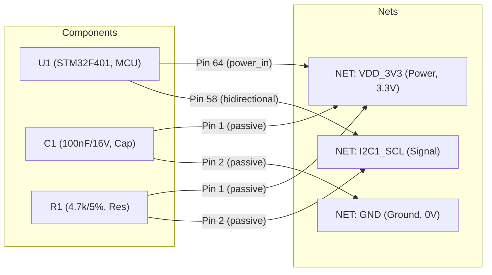

# 線路分析處理管線與圖譜規範 (Pipeline Workflow & Graph Model)

本文檔定義線路設計規則檢查系統 (Schematic DRC System) 的後端處理管線流程 (Pipeline Workflow) 以及 NetworkX 數學圖譜資料標準契約 (Graph Data Model Contract)。

---

## 1. NetworkX 圖譜資料模型標準 (Graph Data Model Contract)

系統在第一步驟（Parsing）即將線路圖結構化為一個 **二分異質圖 (Bipartite Heterogeneous Graph)**。圖中共有兩種 Node（`component` 與 `net`），而連線的引腳即為 Edge（`pin`）。



### 1.1 Component 節點資料規格 (Component Node)

| 屬性名稱 | 型別 | 說明 |
| :--- | :--- | :--- |
| `node_id` | String | 唯一識別代碼（通常為 Reference，如 `U1`、`C12`） |
| `node_type` | Literal["component"] | 固定為 `"component"` |
| `ref` | String | 元件 Reference（如 `U1`） |
| `value` | String | 原始 Value 字串（如 `100nF_X5R_16V`、`STM32F401`） |
| `footprint` | String | 封裝名稱（如 `0402`、`LQFP-64`） |
| `mpn` | String | 製造商零件料號 (Manufacturer Part Number) |
| `supplier` | Optional[String] | 供應商名稱（如 `DigiKey`、`Mouser`） |
| `supplier_pn` | Optional[String] | 供應商零件編號（供 Phase 2 精確鎖定 Datasheet） |
| `description` | Optional[String] | 零件功能描述（如 `IC MCU 32BIT 512KB FLASH`，對 LLM 推理極為關鍵） |
| `is_dnp` | Boolean | 是否未上件（自 XML 之 `BOM`、`ASSY`、`DNP`、`POPULATE` 屬性標準化而來） |
| `page_index` | Integer | 所在圖紙頁碼 |
| `page_name` | String | 所在圖紙名稱（如 `02_MCU_CORE`） |
| `role` | String | 角色分類（如 `Processor/MCU`、`Power/LDO`、`Passive/Capacitor`） |
| `electrical_specs` | Dict | **被動元件數值剖析器** 解析出的電氣數值（詳見下表） |
| `extra_properties` | Dict[str, str] | 保留 OrCAD XML 中所有自訂的 Raw Property Key-Value |

#### `electrical_specs` 剖析規格：
* **電容 (Capacitors)**：
  * `capacitance_farad`: 浮點數法拉值（如 `1e-7` 代表 100nF）
  * `voltage_rating_v`: 額定耐壓伏特數（如 `16.0`，供耐壓降額 DRC 檢查）
  * `dielectric`: 介質種類（如 `X5R`、`X7R`、`NPO`）
* **電阻 (Resistors)**：
  * `resistance_ohm`: 阻值歐姆數（如 `4700.0`，供 I2C 上拉電阻範圍檢查）
  * `tolerance_percent`: 容差百分比（如 `1.0` 代表 1%）
  * `power_rating_w`: 額定瓦數（如 `0.0625` 代表 1/16W）

---

### 1.2 Net 節點資料規格 (Net Node)

| 屬性名稱 | 型別 | 說明 |
| :--- | :--- | :--- |
| `node_id` | String | 網線唯一識別碼（如 `NET_VDD_3V3`） |
| `node_type` | Literal["net"] | 固定為 `"net"` |
| `name` | String | 網線名稱（如 `VDD_3V3`、`I2C1_SCL`） |
| `net_type` | Enum | 網線電氣類型：`POWER`、`GROUND`、`SIGNAL`、`UNCONNECTED` |
| `voltage` | Optional[Float] | 推導電壓值（自網線名稱正則如 `3V3` 或電源晶片輸出端推導，如 `3.3`） |
| `is_global` | Boolean | 是否為跨頁全域信號（具備 Off-Page Connector 或 Global 符號） |
| `fanout` | Integer | 連接的引腳端點總數（`degree`，若為 1 則代表單點懸空） |

---

### 1.3 Edge 資料規格 (Pin Connection)

連接 `Component Node` 與 `Net Node` 之間的 Edge：

| 屬性名稱 | 型別 | 說明 |
| :--- | :--- | :--- |
| `pin_number` | String | 實體引腳編號（如 `"58"`、`"A1"`） |
| `pin_name` | String | 引腳邏輯功能名稱（如 `"PB8/I2C1_SCL"`、`"VDD"`） |
| `pin_type` | String | 電氣型態：`input`、`output`、`bidirectional`、`power_in`、`passive`、`tri_state`、`open_collector` |
| `is_no_connect` | Boolean | 圖面上是否掛載 No-Connect (NC 打叉) 符號 |

---

## 2. 預先分析與規則推薦工作流 (Pre-Analysis Phase)

當使用者在前端上傳壓縮檔 (`.zip` / `.7z`) 時，系統立即進行快速預檢（約 1~3 秒完成）：

```
[使用者上傳 ZIP]
        │
        ▼
【1. 解壓縮與預檢】─── 檢查是否包含 XML、Netlist 與 PDF
        │
        ▼
【2. 快速建圖 (Graph)】 (僅花費數百毫秒完成 Bipartite 構建)
        │
        ▼
【3. 掃描特徵】─────── 呼叫 Core Ranker 辨別主控、Pattern 辨別 Bus (I2C/SPI/USB)
        │
        ▼
【4. 規則庫比對】───── 比對 drc_rules.triggers 標籤 (GLOBAL, BUS:I2C, PLATFORM:ESP32)
        │
        ▼
【5. 回傳三層樹】───── 前端呈現樹狀圖，自動打勾建議規則，使用者可增刪調整
```

### 三層樹狀圖結構：
1. **第一層：全域電氣與規範 (Global Electrical Rules)**
   * 懸空引腳檢查、單點 Net 檢查、電源/接地短路、電容耐壓降額。
2. **第二層：偵測到的通訊匯流排 (Detected Communication Buses)**
   * `I2C 匯流排 (I2C0, I2C1)`：I2C 地址唯一性、上拉電阻阻值、上拉電源電位。
   * `SPI 匯流排 (SPI2)`：片選 (CS) 腳位指派、單向/雙向傳輸判定。
   * `USB 介面 (USB0)`：D+/D- 差分對配對、ESD 保護二極體。
3. **第三層：主控平台與特定外圍晶片 (Platform & Target ICs)**
   * `主控晶片 (STM32F401)`：Boot 腳位配置、Reset 上拉電容、晶振電路。
   * `電量計 (BQ27220)`：電源引腳獨立性、電流採樣電阻配置。

---

## 3. 正式 DRC 分析執行管線 (Formal DRC Execution Pipeline)

使用者確認規則勾選後，發起正式任務，由 Celery Worker 單執行緒 (Concurrency=1) 執行：

```
[Celery Worker 開始任務]
            │
            ▼
【步驟 1：載入圖譜與規則快照】
            │
            ▼
【步驟 2：傳統程式檢查 (Heuristic DRC)】 (Handler 註冊碼呼叫 + JSONB 門檻比對)
            │  ── 每個動作受 Action Timeout (預設 60s) 保護
            │  ── 實時推播 Redis 進度
            ▼
【步驟 3：LLM 語意邏輯審查 (LLM Review)】
            │  ── 依 context_extractor 僅萃取局部子圖 (Subgraph)
            │  ── 填入 prompt_template 呼叫 LiteLLM (受 45s Timeout 保護)
            │  ── Langfuse 全鏈路記錄 Trace ID
            ▼
【步驟 4：報告彙整與落地 (Report Synthesis)】
            │  ── 產生 Summary Dashboard 與 Violations List
            │  ── 寫入 drc_reports 資料表
            ▼
[任務完成，前端 WebSocket 接收完成通知]
```

### 3.1 程式檢查 (Heuristic) 綁定範例 (`handler_name`)
在後端 `backend/app/engine/heuristic/` 中使用裝飾器註冊：
```python
from app.engine.heuristic.registry import register_rule

@register_rule("check_i2c_address_conflict")
def verify_i2c_address(graph: nx.Graph, bus_data: dict, parameters: dict) -> list[dict]:
    # 執行圖論與地址比對邏輯...
    # 回傳 PASS 或 FAIL 項目
    pass
```

### 3.2 LLM 局部子圖萃取器 (`context_extractor`)
避免將成千上萬個節點塞給 LLM，系統只萃取目標局部：
* **`extract_bus_subgraph`**：僅萃取掛在特定匯流排上的晶片、Pin 腳、上拉電阻與其電源線。
* **`extract_component_peripherals`**：僅萃取特定 IC 的所有引腳及其相鄰第一層元件（如去耦電容、晶振、分壓電阻）。
