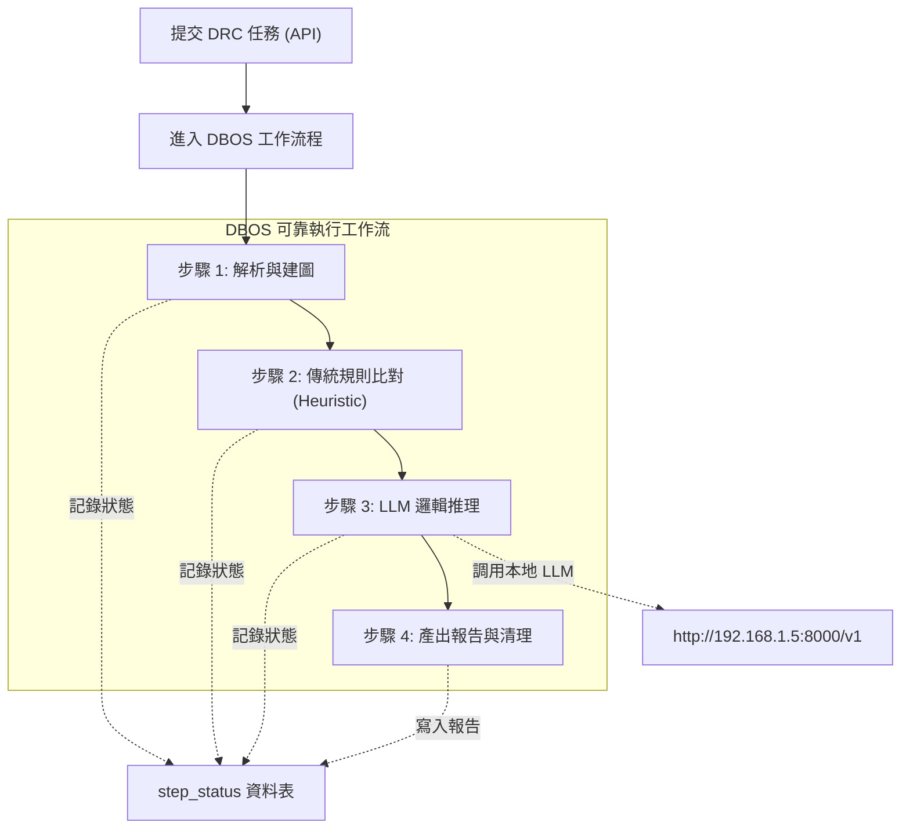

# 線路分析處理管線與圖譜規範 (Pipeline Workflow & Graph Model)

本文檔定義系統後端基於 Postgres DBOS (Durable Execution) 的處理管線流程以及 NetworkX 圖譜資料模型。

---

## 1. NetworkX 圖譜資料模型標準 (Graph Data Model Contract)
系統將線路圖結構化為二分異質圖 (Bipartite Heterogeneous Graph)，包含 Component 與 Net 節點，以及 Pin 邊。

## 2. 雙軌執行路徑 (Dual-Execution Path)

### 2.1 輕量預先分析 (Lightweight Pre-analysis)
* **目的**：避免阻礙後續排隊的重型任務 (Head-of-line blocking)。
* **流程**：使用者上傳檔案後，立即執行輕量的壓縮檔預檢與基本特徵掃描 (如偵測 I2C, SPI, 平台 IC)，並回傳「建議規則清單」供前端樹狀圖渲染。

### 2.2 重型 DRC 任務 (Heavy DRC Workflow via DBOS)
使用者確認規則後，提交正式任務交由 DBOS 引擎以可靠執行模式處理。

### 2.3 原生斷點接續 (DBOS Checkpointing)
因採用 DBOS，每完成一個步驟或呼叫外部 API (如 LLM)，DBOS 皆會原生持久化狀態至 PostgreSQL。
若伺服器當機或意外重啟，DBOS 啟動後會自動從最後完成的步驟 (Step) 接續執行，無需手動編寫複雜的 Checkpoint/Resume 邏輯，徹底實現零 Token 浪費與高穩定性。
