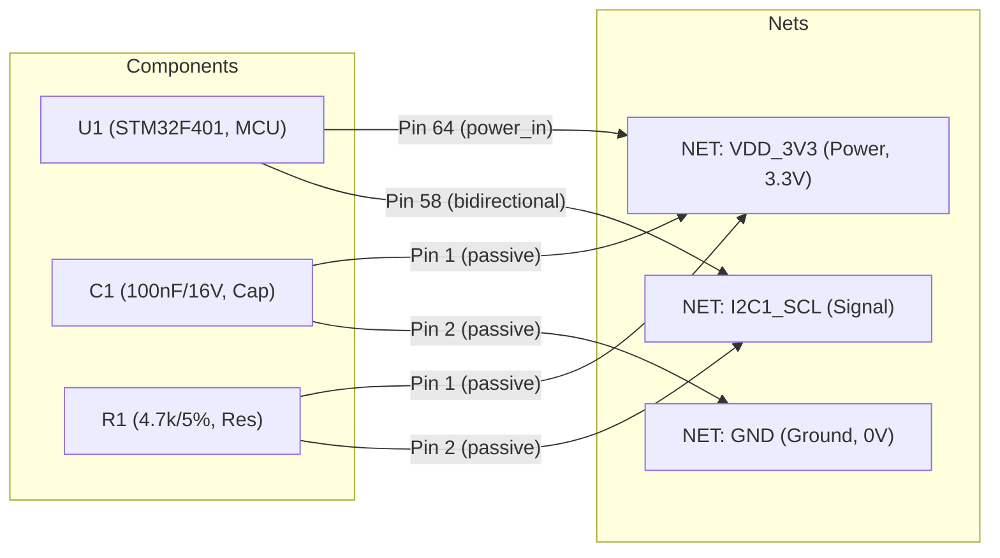

# 線路分析處理管線與圖譜規範 (Pipeline Workflow & Graph Model)

本文檔定義線路設計規則檢查系統 (Schematic DRC System) 的後端處理管線流程 (Pipeline Workflow) 以及 NetworkX 數學圖譜資料標準契約 (Graph Data Model Contract)。

---

## 1. NetworkX 圖譜資料模型標準 (Graph Data Model Contract)

系統在第一步驟（Parsing）即將線路圖結構化為一個 **二分異質圖 (Bipartite Heterogeneous Graph)**。圖中共有兩種 Node（`component` 與 `net`），而連線的引腳即為 Edge（`pin`）。



### 1.1 Component 節點資料規格 (Component Node)

| 屬性名稱 | 型別 | 說明 |
| :--- | :--- | :--- |
| `node_id` | String | 唯一識別代碼（通常為 Reference，如 `U1`、`C12`） |
| `node_type` | Literal["component"] | 固定為 `"component"` |
| `ref` | String | 元件 Reference（如 `U1`） |
| `value` | String | 原始 Value 字串（如 `100nF_X5R_16V`、`STM32F401`） |
| `footprint` | String | 封裝名稱（如 `0402`、`LQFP-64`） |
| `mpn` | String | 製造商零件料號 (Manufacturer Part Number) |
| `supplier` | Optional[String] | 供應商名稱（如 `DigiKey`、`Mouser`） |
| `supplier_pn` | Optional[String] | 供應商零件編號（供 Phase 2 精確鎖定 Datasheet） |
| `description` | Optional[String] | 零件功能描述（如 `IC MCU 32BIT 512KB FLASH`，對 LLM 推理極為關鍵） |
| `is_dnp` | Boolean | 是否未上件（自 XML 之 `BOM`、`ASSY`、`DNP`、`POPULATE` 屬性標準化而來） |
| `page_index` | Integer | 所在圖紙頁碼 |
| `page_name` | String | 所在圖紙名稱（如 `02_MCU_CORE`） |
| `role` | String | 角色分類（如 `Processor/MCU`、`Power/LDO`、`Passive/Capacitor`） |
| `electrical_specs` | Dict | **被動元件數值剖析器** 解析出的電氣數值（詳見下表） |
| `extra_properties` | Dict[str, str] | 保留 OrCAD XML 中所有自訂的 Raw Property Key-Value |

#### `electrical_specs` 剖析規格：
* **電容 (Capacitors)**：
  * `capacitance_farad`: 浮點數法拉值（如 `1e-7` 代表 100nF）
  * `voltage_rating_v`: 額定耐壓伏特數（如 `16.0`，供耐壓降額 DRC 檢查）
  * `dielectric`: 介質種類（如 `X5R`、`X7R`、`NPO`）
* **電阻 (Resistors)**：
  * `resistance_ohm`: 阻值歐姆數（如 `4700.0`，供 I2C 上拉電阻範圍檢查）
  * `tolerance_percent`: 容差百分比（如 `1.0` 代表 1%）
  * `power_rating_w`: 額定瓦數（如 `0.0625` 代表 1/16W）

---

### 1.2 Net 節點資料規格 (Net Node)

| 屬性名稱 | 型別 | 說明 |
| :--- | :--- | :--- |
| `node_id` | String | 網線唯一識別碼（如 `NET_VDD_3V3`） |
| `node_type` | Literal["net"] | 固定為 `"net"` |
| `name` | String | 網線名稱（如 `VDD_3V3`、`I2C1_SCL`） |
| `net_type` | Enum | 網線電氣類型：`POWER`、`GROUND`、`SIGNAL`、`UNCONNECTED` |
| `voltage` | Optional[Float] | 推導電壓值（自網線名稱正則如 `3V3` 或電源晶片輸出端推導，如 `3.3`） |
| `is_global` | Boolean | 是否為跨頁全域信號（具備 Off-Page Connector 或 Global 符號） |
| `fanout` | Integer | 連接的引腳端點總數（`degree`，若為 1 則代表單點懸空） |

---

### 1.3 Edge 資料規格 (Pin Connection)

連接 `Component Node` 與 `Net Node` 之間的 Edge：

| 屬性名稱 | 型別 | 說明 |
| :--- | :--- | :--- |
| `pin_number` | String | 實體引腳編號（如 `"58"`、`"A1"`） |
| `pin_name` | String | 引腳邏輯功能名稱（如 `"PB8/I2C1_SCL"`、`"VDD"`） |
| `pin_type` | String | 電氣型態：`input`、`output`、`bidirectional`、`power_in`、`passive`、`tri_state`、`open_collector` |
| `is_no_connect` | Boolean | 圖面上是否掛載 No-Connect (NC 打叉) 符號 |

---

## 2. 預先分析與規則推薦工作流 (Pre-Analysis Phase)

當使用者在前端上傳壓縮檔 (`.zip` / `.7z`) 時，系統立即進行快速預檢（約 1~3 秒完成）：

```
[使用者上傳 ZIP (含 XML + Netlist)]
        │
        ▼
【1. 解壓縮與預檢】─── 檢查是否包含 XML 與 Netlist
        │
        ▼
【2. 快速建圖 (Graph)】 (僅花費數百毫秒完成 Bipartite 構建)
        │
        ▼
【3. 掃描特徵】─────── 呼叫 Core Ranker 辨別主控、Pattern 辨別 Bus (I2C/SPI/USB)
        │
        ▼
【4. 規則庫比對】───── 比對 drc_rules.triggers 標籤 (GLOBAL, BUS:I2C, PLATFORM:ESP32)
        │
        ▼
【5. 回傳三層樹】───── 前端呈現樹狀圖，自動打勾建議規則，使用者可增刪調整
```

### 三層樹狀圖結構：
1. **第一層：全域電氣與規範 (Global Electrical Rules)**
   * 懸空引腳檢查、單點 Net 檢查、電源/接地短路、電容耐壓降額。
2. **第二層：偵測到的通訊匯流排 (Detected Communication Buses)**
   * `I2C 匯流排 (I2C0, I2C1)`：I2C 地址唯一性、上拉電阻阻值、上拉電源電位。
   * `SPI 匯流排 (SPI2)`：片選 (CS) 腳位指派、單向/雙向傳輸判定。
   * `USB 介面 (USB0)`：D+/D- 差分對配對、ESD 保護二極體。
3. **第三層：主控平台與特定外圍晶片 (Platform & Target ICs)**
   * `主控晶片 (STM32F401)`：Boot 腳位配置、Reset 上拉電容、晶振電路。
   * `電量計 (BQ27220)`：電源引腳獨立性、電流採樣電阻配置。

---

## 3. 正式 DRC 分析執行管線 (Formal DRC Execution Pipeline)

使用者確認規則勾選後，發起正式任務，由 Celery Worker 單執行緒 (Concurrency=1) 執行。系統全流程支援**「檢查點持久化 (Checkpointing)」**與**「差異化執行 (Differential Execution)」**：

```
[Celery Worker 開始任務 / 斷點接續]
            │
            ▼
【步驟 1：載入/構建圖譜 (Graph Cache)】
   ├── 首次執行：解壓 XML/Netlist ➔ 建圖 ➔ 序列化儲存至 /app/storage/graphs/{task_id}.pickle
   ├── 斷點接續 (Resume)：直接讀取 pickle 檔案，跳過重複解壓縮建圖 (耗時縮減至數毫秒)
   └── 📢 Log 回報：發布圖譜節點/邊總數、快取命中狀態與載入耗時
            │
            ▼
【步驟 2：差異化規則排程 (Differential Scheduling)】
   ├── 讀取 drc_tasks.checkpoint_data 之 completed_rule_ids
   ├── 動態計算剩餘規則：remaining_rules = selected_rules - completed_rules
   └── 📢 Log 回報：發布差異化審計日誌（如「已略過完成規則 15 項，接續執行剩餘 27 項」）
            │
            ▼
【步驟 3：逐條規則驗證與檢查點寫入 (Execution Loop)】
   ├── 傳統程式檢查 (Heuristic DRC)：調用 handler_name (受 60s Timeout 保護)
   ├── LLM 語意邏輯審查 (LLM Review)：萃取子圖 ➔ 呼叫 LiteLLM (受 45s Timeout 保護)
   ├── 🌟 每完成一條規則：立即 Append 至 drc_tasks.checkpoint_data，防止重啟遺失
   └── 📢 Log 回報：每條規則驗證前推播 `RULE_START`，完成後推播 `RULE_DONE` (附帶狀態 PASS/FAIL 與耗時)
            │
            ▼
【步驟 4：報告彙整與資源清理 (Report Synthesis & Immediate Cleanup)】
   ├── 彙整前期檢查點結果與本次產出 ➔ 寫入 drc_reports 資料表
   ├── 狀態變更為 COMPLETED
   ├── 🌟 立即清除 /app/storage/staging/{task_id}/ 解壓中繼檔，釋放磁碟空間
   └── 📢 Log 回報：推播報告生成完畢統計 (通過率、耗時) 及中繼檔已清理日誌
            │
            ▼
[任務完成，前端 WebSocket 接收完成通知]
```

### 3.1 斷點接續、即時 Log 回報與差異化執行虛擬碼範例
```python
def execute_drc_pipeline(task_id: str, is_resume: bool = False):
    task = get_task_by_id(task_id)
    checkpoint = task.checkpoint_data or {"completed_rule_ids": [], "partial_violations": []}
    logger = TaskProgressLogger(task_id) # 封裝 Redis Pub/Sub 與 DB execution_logs 寫入
    
    # 1. 取得圖譜 (快取優先)
    graph_path = f"/app/storage/graphs/{task_id}.pickle"
    if is_resume and os.path.exists(graph_path):
        logger.info("RESUME", "偵測到圖譜快照，直接反序列化載入...", progress=10)
        t0 = time.time()
        graph = load_graph_pickle(graph_path)
        logger.info("PARSE_AND_GRAPH", f"圖譜快照載入成功，耗時 {(time.time()-t0)*1000:.1f}ms", progress=15)
    else:
        logger.info("PARSE_AND_GRAPH", "正在解壓 Cadence 壓縮包並構建 NetworkX 圖譜...", progress=5)
        graph = parse_and_build_bipartite_graph(task.file_paths)
        save_graph_pickle(graph, graph_path)
        logger.info("PARSE_AND_GRAPH", f"圖譜構建完成 (節點: {graph.number_of_nodes()}, 邊: {graph.number_of_edges()})", progress=15)
    
    # 2. 差異化比對：排除已跑過的規則
    completed_ids = set(checkpoint.get("completed_rule_ids", []))
    remaining_rules = [r for r in task.selected_rules if r["id"] not in completed_ids]
    
    if is_resume:
        logger.resume("DIFFERENTIAL_AUDIT", 
                      f"[差異化排程] 總規則 {len(task.selected_rules)} 項：已略過先前完成之 {len(completed_ids)} 項，接續執行剩餘 {len(remaining_rules)} 項", 
                      progress=20)
    
    # 3. 逐條執行並即時存檔與回報 Log
    total_count = len(task.selected_rules)
    for idx, rule in enumerate(remaining_rules, start=len(completed_ids) + 1):
        progress = int((idx / total_count) * 80) + 15 # 映射進度 15%~95%
        logger.rule_start(rule["id"], f"[{idx}/{total_count}] 正在驗證: {rule['name']} ({rule['check_type']})...", progress)
        
        # 執行規則檢測 (含細粒度逾時防護)
        result = run_single_rule_check(graph, rule, timeout=rule.get("timeout", 60))
        
        # 立即寫入 Checkpoint，就算主機意外斷電，前面規則結果也安全保存
        save_rule_checkpoint(task_id, rule_id=rule["id"], result=result)
        
        # 即時回報該條規則執行結果 Log
        status_text = f"[{result['status']}] {rule['name']}"
        logger.rule_done(rule["id"], status_text, status=result["status"], progress=progress)
        
    # 4. 產出報告並清理中繼目錄
    logger.info("REPORT_SYNTHESIS", "正在彙整所有規則結果並生成 DRC 最終報告...", progress=96)
    synthesize_final_report(task_id)
    
    cleanup_task_staging_dir(task_id) # 確實清除 /storage/staging/{task_id}/
    logger.info("CLEANUP", "已清理任務解壓縮中繼目錄，釋放磁碟空間", progress=100)
    logger.done("DRC 分析完成！報告已就緒。")
```

### 3.2 程式檢查 (Heuristic) 綁定範例 (`handler_name`)
在後端 `backend/app/engine/heuristic/` 中使用裝飾器註冊：
```python
from app.engine.heuristic.registry import register_rule

@register_rule("check_i2c_address_conflict")
def verify_i2c_address(graph: nx.Graph, bus_data: dict, parameters: dict) -> list[dict]:
    # 執行圖論與地址比對邏輯...
    # 回傳 PASS 或 FAIL 項目
    pass
```

### 3.3 LLM 局部子圖萃取器 (`context_extractor`)
避免將成千上萬個節點塞給 LLM，系統只萃取目標局部：
* **`extract_bus_subgraph`**：僅萃取掛在特定匯流排上的晶片、Pin 腳、上拉電阻與其電源線。
* **`extract_component_peripherals`**：僅萃取特定 IC 的所有引腳及其相鄰第一層元件（如去耦電容、晶振、分壓電阻）。
